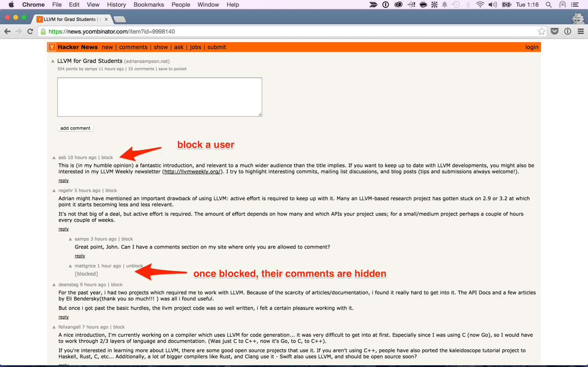

# [Hacker News Blocklist](https://chrome.google.com/webstore/detail/hn-blocklist/cgphkkepnnepcjnjgboihccobkjoecoc)
While Hacker News is in general a great community, sometimes certain users consistently rub you the wrong way. This extension allows you to avoid long arguments by blocking said users.

Within comment threads, a new "block" button is added to block a user. Once blocked, all the user's comments are blocked across Hacker News for you. You can unblock users at any time.

The blocklist is personal to you and not shared with other users. Blocking applies only to comments, not submissions.

# Installation
The extension can be installed from the [Chrome store](https://chrome.google.com/webstore/detail/hn-blocklist/cgphkkepnnepcjnjgboihccobkjoecoc?hl=en).

# Screenshot

